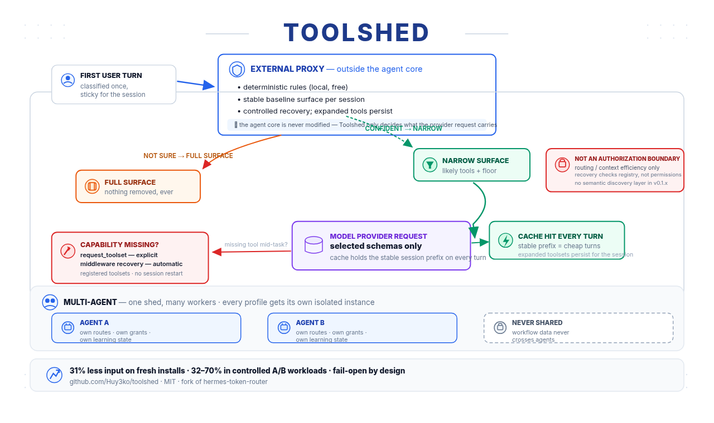

# Toolshed

<p align="center">
  <strong>Less tool overhead. Same agent capabilities.</strong>
</p>

<p align="center">
  An adaptive tool-surface proxy for Hermes that sends a smaller, relevant tool set to the model<br>
  while keeping missing capabilities reachable through Hermes' native recovery path.
</p>



## Measured results

| Test | Router OFF | Toolshed ON | Reduction |
| --- | ---: | ---: | ---: |
| Fresh GitHub canary run (single agent) | 15,263 input tokens | 8,696 input tokens | **43%** |
| Earlier controlled paired workloads | — | — | **24–70%** |

These are measured results, not a universal savings guarantee. Savings depend on the task, the
installed tool surface, routing confidence and the shape of the provider request. The validation
history — including experiments that were rejected — lives in [`adr/`](adr/).

## Why Toolshed?

Hermes agents accumulate dozens of tools, and every visible tool carries schema text into each
provider request — even when most of it is irrelevant to the current task.

Toolshed sits outside the agent core and reduces that surface before the request is sent:

- **Narrow when confident** — the likely working set plus protected floor tools go to the model.
- **Fail open when uncertain** — low confidence keeps the full surface instead of risking capability loss.
- **Recover when needed** — a missing toolset can be added mid-session through `request_toolset`, or automatically when the agent calls a registered-but-filtered tool (middleware recovery).
- **Keep agents isolated** — routes, grants, learning and telemetry stay profile-local.
- **No silent privileges** — Toolshed cannot touch the tool surface without Hermes' explicit `tools.override` grant.

## Quick start

**About profiles:** Hermes calls each agent configuration a *profile*. If you run one agent,
that's `default`. With several agents, repeat these steps for every profile.

> **Important: install Toolshed from the `/runtime` subdirectory.** Installing the repository
> root (`Huy3ko/toolshed`) makes Hermes scan the full development repository — ADRs, CI files,
> contributor docs — which the security scanner will likely block as DANGEROUS. The `/runtime`
> path contains only the actual runtime payload.
>
> **Termux / Android:** this report originally came from a Termux user. The rule is the same
> there: install via `Huy3ko/toolshed/runtime`, never via the repo root. The installer and
> updater scripts require `bash` (Termux's default shell is fine; `sh`/busybox-only setups
> are not supported).

```bash
# 1. Install from the v0.1.7 release commit
hermes -p default plugins install Huy3ko/toolshed/runtime \
  --ref <v0.1.7-commit-sha>

# 2. Authorize the tool-surface override
hermes -p default plugins enable hermes-token-router --allow-tool-override
```

The grant lets Toolshed change **which already-authorized tools are visible to the model** — it does
not create new permissions. Installation and authorization are deliberately separate steps:
no grant, no routing.

```bash
# 3. Turn routing on — in the installed plugin's config.yaml:
#    global: enabled: true
```

Then verify:

```bash
hermes -p default plugins capabilities hermes-token-router
# → tools.override: granted
```

When routing is active you'll see `deterministic route reason=…` and `narrowed to N toolsets`
in the Hermes logs.

## How it works

1. The first user turn is classified; the result stays sticky for the session.
2. Confident prediction → only likely tools + floor stay visible. Uncertainty → full surface.
3. A missing capability mid-task? Native Hermes recovery adds that toolset on demand.

That's the whole mechanism. Details are in the diagram above and in the ADRs.

## Multiple agents

One profile = one agent = isolated state:

```bash
hermes -p coding plugins install Huy3ko/toolshed/runtime \
  --ref <v0.1.7-commit-sha>
hermes -p coding plugins enable hermes-token-router --allow-tool-override
```

Routes, grants, learning and telemetry are intended to remain profile-local. The
current source uses Hermes' profile home/context as the isolation key, but a
productive multiplex-gateway isolation run is still a release validation task.
Re-verify it after upstream profile-semantics changes.

## Update

```bash
hermes -p default plugins update hermes-token-router
```

**Shipped behavior:** the runtime updater preserves `global.enabled`, `mode`,
`floor_toolsets`, grants and the plugin tree when an update fails. Prefer the
payload updater for a controlled update:

```bash
runtime/update.sh --profile default --ref <v0.1.7-commit-sha>
```

After updating, run the bundled doctor and check version/commit, grant,
`global.enabled` and `mode`:

```bash
runtime/doctor.sh --profile default
```

## Pinned installs & rollback

`plugins install owner/repo` follows the default branch — it does not automatically mean "latest
release". For reproducible deployments, pin the commit behind a release:

```bash
hermes -p default plugins install Huy3ko/toolshed/runtime \
  --ref <release-commit-sha> --force
```

Rollback works the same way with the previous release's commit SHA. One Git detail matters here:
annotated tags have their own object SHA — Hermes expects the **commit SHA behind the tag**.

## Uninstall

```bash
hermes -p default plugins remove hermes-token-router
```

Hermes keeps working without Toolshed. The upstream uninstaller may leave the grant entry in your
config — it doesn't keep anything running, but remove it if you don't want it retained for a possible
reinstall.

## Session semantics: stable baseline + controlled mid-session recovery

The router projects a narrow **baseline surface** at the start of a session (predicted working set
plus protected floor tools). This baseline is not re-routed arbitrarily mid-session — but a session
does **not** need to be restarted when an additional capability turns out to be needed later.

There are two defined recovery paths, and both take effect within the same session:

1. **Explicit — `request_toolset`.** A small escape-hatch tool that stays available after narrowing.
   The agent can request one or more registered toolsets by name, or resolve a known tool via its
   `tool_name` parameter. Expansion takes effect immediately and persists for the rest of the
   session. Unknown toolset names fail closed with closest-match suggestions and the list of
   available toolsets.
2. **Automatic — middleware recovery.** If the agent calls a *registered* tool that was filtered out
   of the current surface, middleware expands the owning toolset before dispatch so the original
   call executes instead of failing with "invalid tool". This is automatic recovery, not a new
   router projection and not explicit agent intent.

A successfully expanded toolset remains available for the remainder of the session.

> **What Toolshed is not:** Toolshed is a routing and context-efficiency layer, **not an
> authorization boundary**. The recovery paths check registry existence, not permissions — if the
> relevant tool/toolset is registered, it can be requested through the recovery path. Access control
> remains Hermes' job (plugin grants, tool approvals). Do not deploy Toolshed as a security
> perimeter.

There is no semantic discovery layer in v0.1.x: a capability must be resolvable as a registered
toolset or tool name to be recovered. Controlled experiments with passive capability indexes showed
no measurable causal benefit over this recovery model, so it ships deliberately without one.

## Security model

Toolshed changes which tools the model sees, so its contract is explicit:

- **Fail-closed on authorization:** no `tools.override` grant → no surface manipulation.
- **Fail-open on routing uncertainty:** uncertainty keeps capabilities rather than removing them.
- **Recovery stays native:** missing registered capabilities can be recovered during the session
  (explicit `request_toolset` or automatic middleware recovery — see "Session semantics" above).
- **Floor policy is not content-controlled:** prompt or repository text cannot rewrite it.
- **Routing ≠ permission:** making a tool visible never creates permissions the agent didn't have.
  Recovery is limited to the agent's original Hermes-enabled toolsets and still
  relies on Hermes for final tool authorization.
- **Profile state stays isolated** across agents.

Adversarial testing covered manipulated repository content, read-only GitHub workflows, recovery,
stale capabilities and multi-profile isolation. See [SECURITY.md](SECURITY.md) for the full model
and how to report vulnerabilities.

## Known limitations

- Gateway-restart / learning persistence has not yet been fully validated under `systemd --user`.
- Less permanent tool visibility can reduce spontaneous exploration; required capabilities remained
  recoverable in all validated tests.
- `plugins install owner/repo` follows the default branch, not the latest release tag.
- The bundled installer/updater/doctor are deterministic shell helpers, but no
  productive multi-profile lifecycle or restart test is claimed here.
- Static compatibility targets Hermes v0.21.0 (`b6f42c66` upstream;
  `78bc2dd4` local); provider, gateway and prompt-cache value still require
  live validation.

## Configuration

Defaults are intentionally small:

```yaml
global:
  enabled: true            # router on/off
  mode: active             # active = route | shadow = observe only
  floor_toolsets:          # protected: never pruned
    - terminal
    - file
    - skills
    - memory
    - web

shadow:
  enabled: true            # profile-local learning bridge
```

Keep `floor_toolsets` small — everything on it rides along in every request. Per-profile overrides
live under `profiles.<name>` for advanced setups.

## For contributors

Architecture decisions, rejected mechanisms and validation history are documented, not hidden:
[`adr/`](adr/) · [`CHANGELOG.md`](CHANGELOG.md) · [`CONTRIBUTING.md`](CONTRIBUTING.md) ·
[`SECURITY.md`](SECURITY.md)

Project rule in one line:

> No mechanism gets added because it sounds good — only when a controlled test shows it's needed.

## Fork heritage & license

Toolshed is based on MIT-licensed `hermes-token-router` work by Jonathan Rivera (archived upstream)
and was substantially extended: dynamic MCP routing, compatibility work against current Hermes
upstream, lifecycle validation, security testing. See [`NOTICE`](NOTICE) and [`LICENSE`](LICENSE).

MIT.
